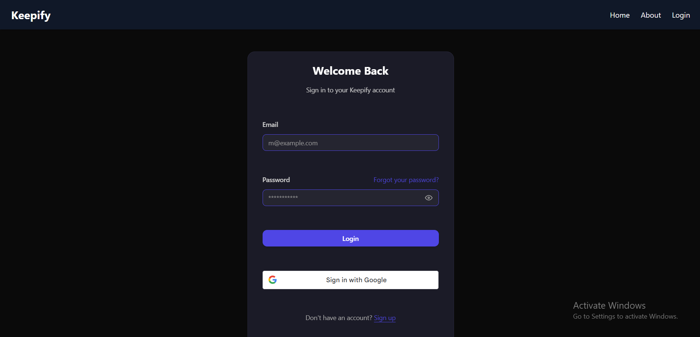
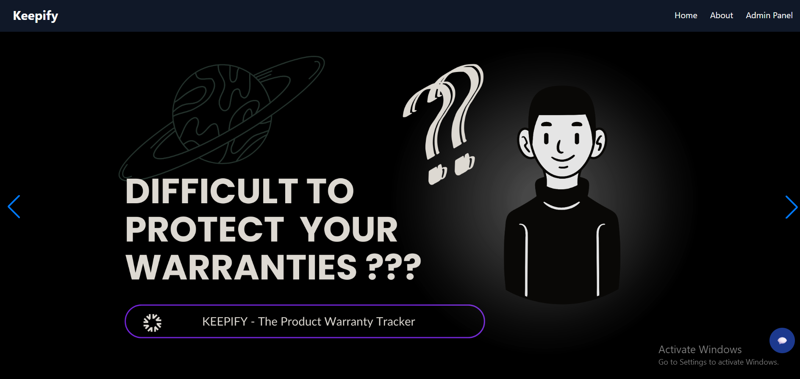
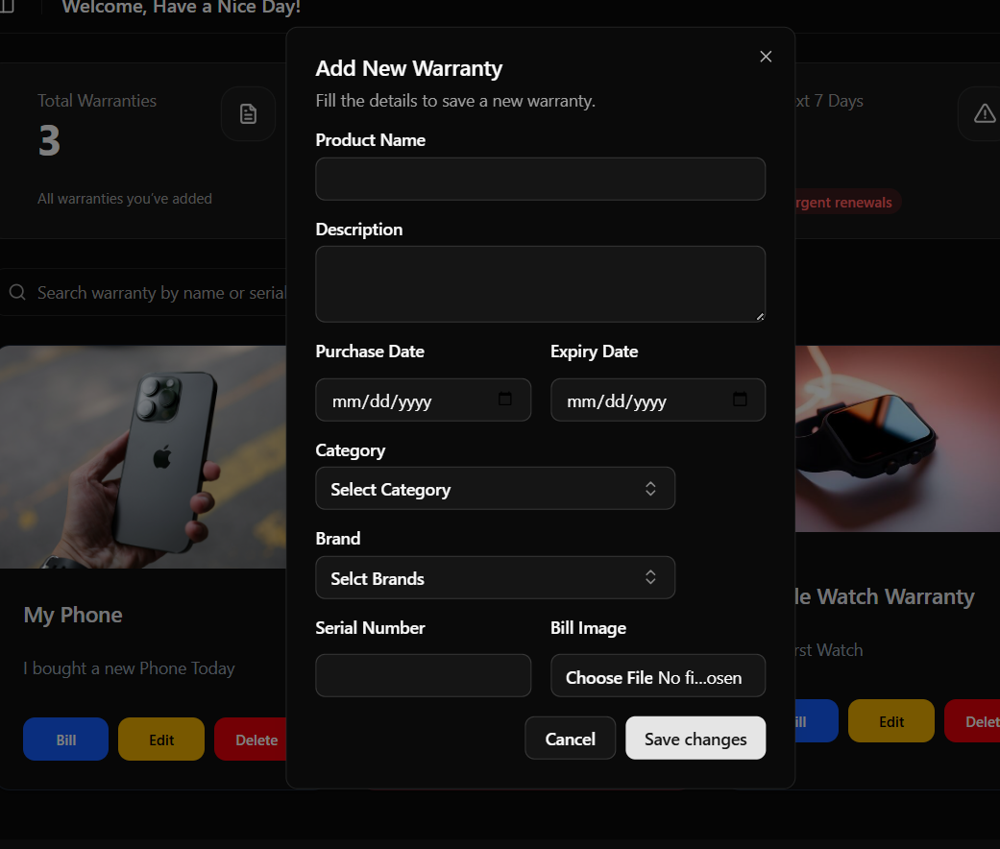
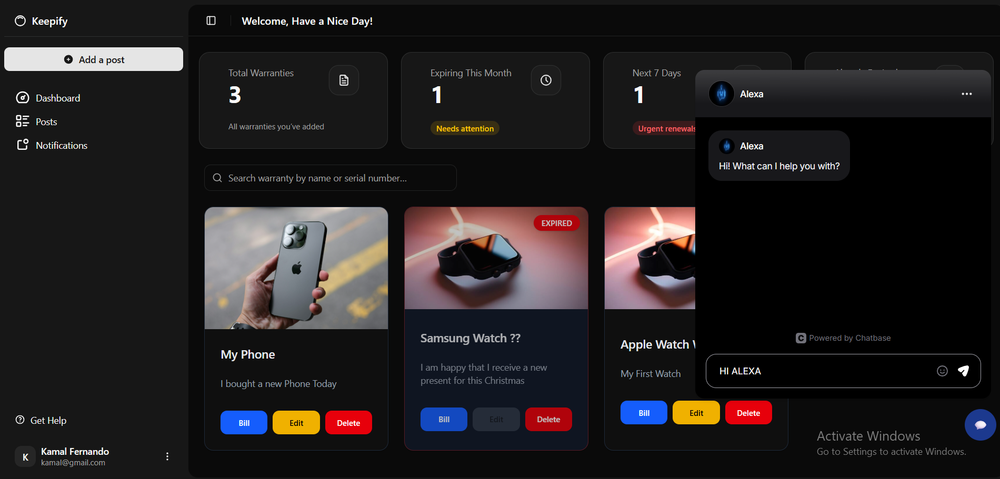
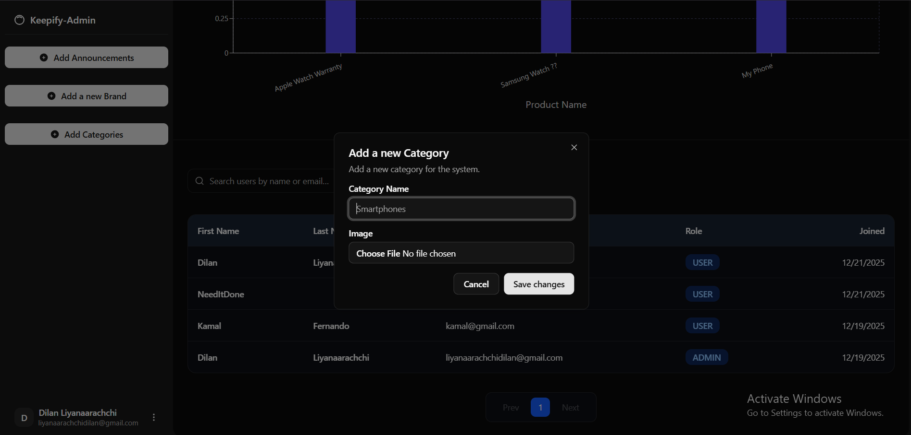
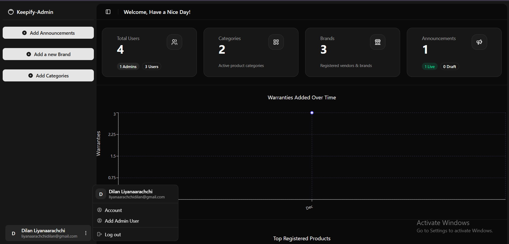
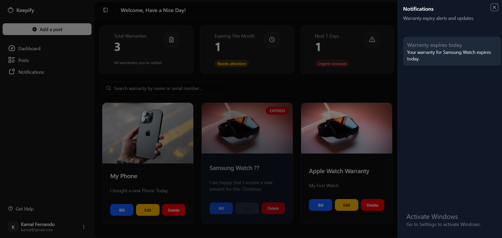
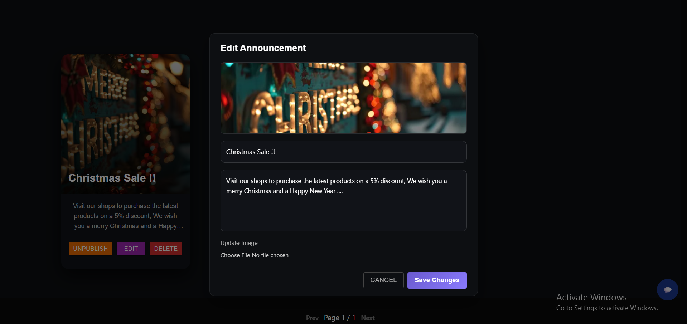

# 📦 Keepify – Warranty & Purchase Management System

Keepify is a modern warranty and purchase tracking platform that helps users securely store product warranties, receive expiry notifications, and manage purchases in one place. The system supports both traditional email/password authentication and Google Sign-In, includes automated expiry checks, and provides user-friendly dashboards with reports and reminders.

## 🚀 Live Demo

Keepify Project Url (Vercel):
👉 https://keepify-the-product-warranty-tracke.vercel.app/

Backend API (Vercel):
👉 https://keepify-the-product-warranty-tracke-lemon.vercel.app/

Back End Respository (Git Hub): 
 👉 https://github.com/DiilaNa/Keepify-The_Product_Warranty_Tracker-BackEnd.git

## 🛠 Technologies & Tools Used

### Frontend
- React + TypeScript
- Redux Toolkit 
- Tailwind CSS
- React Router
- Chart.js / Recharts (for reports)
- Google OAuth (One Tap & Sign-In)

### Backend
- Node.js
- Express.js
- TypeScript
- MongoDB Atlas
- Mongoose
- JWT Authentication (Access & Refresh Tokens)
- Nodemailer (Email notifications)

### Infrastructure & DevOps
- Vercel (Frontend + Cron Jobs)
- MongoDB Atlas (Cloud Database)
- Vercel Cron Jobs (Automated expiry checks)
- Postman (API testing)
- Git & GitHub (Version control)

## ✨ Main Features

### 🔐 Authentication
- User registration & login
- Google Sign-In integration
- Secure JWT-based authentication
- Role-based access (USER / ADMIN)

### 📄 Warranty Management
Add warranties with:
- Product name
- Category
- Brand
- Purchase & expiry dates
- Serial number
- Bill image upload

Additional features:
- Edit & delete warranties
- View all warranties in a dashboard

### ⏰ Expiry Notifications
- Automated daily expiry check using Vercel Cron Jobs
- Notifications generated before warranty expiry
- Email alerts for expiring warranties

### 🔔 Notifications
- In-app notifications
- Unread notification counter
- Expiry reminders

### 🤖 AI Chat Assistant
- Integrated chatbot for user assistance
- Responsive floating chat UI

### 🎨 UI / UX
- Fully responsive design
- Dark mode support
- Modern sidebar & navigation
- Mobile-friendly layouts

## 🖼 Screenshots

### Login Page


### Welcome Page


### Add Warranty Form


### User Dashboard


### Admin Dashboard


### Charts and Reports


### Notifications Panel


### Edit Announcements


## ⚙️ Setup & Run Instructions

### 📁 Clone the Repository
```bash
git clone https://github.com/your-username/keepify.git
cd keepify
```

### 🖥 Backend Setup (MERN – Express API)

1. Navigate to backend directory
```bash
cd backend
```

2. Install dependencies
```bash
npm install
```

3. Create `.env` file with the following variables:
```
PORT=5000
MONGO_URI=your_mongodb_atlas_url
JWT_SECRET=your_jwt_secret
JWT_REFRESH_SECRET=your_refresh_secret
GOOGLE_CLIENT_ID=your_google_client_id
EMAIL_USER=your_email@gmail.com
EMAIL_PASS=your_app_password
CRON_SECRET=your_secure_cron_token
```

4. Run backend (development)
```bash
npm run dev
```

5. Backend will run on
```
http://localhost:5000
```

### 🌐 Frontend Setup (React + Vite)

1. Navigate to frontend directory
```bash
cd frontend
```

2. Install dependencies
```bash
npm install
```

3. Create `.env` file with the following variables:
```
VITE_API_BASE_URL=http://localhost:5000
VITE_GOOGLE_CLIENT_ID=your_google_client_id
```

4. Run frontend
```bash
npm run dev
```

5. Frontend will run on
```
http://localhost:5173
```

## ⏱ Cron Job (Expiry Check)

Keepify uses Vercel Cron Jobs to automatically check warranty expiry daily.

`vercel.json`
```json
{
  "crons": [
    {
      "path": "/api/v1/cron/run-expiry-check",
      "schedule": "0 0 * * *"
    }
  ]
}
```

### Security
- Cron endpoint is protected using x-cron-token
- Only Vercel can trigger the job securely

### Verification
- Logs available in Vercel Dashboard
- Email sent on successful cron execution (test confirmation)

## 🔒 Security Highlights
- JWT-based authentication
- Refresh token mechanism
- Secure cron endpoint validation
- Environment variables for secrets
- Role-based access control

## 📌 Future Enhancements
- Push notifications
- PDF export for reports
- Multi-language support
- Vendor warranty integrations
- Admin analytics dashboard

## 👨‍💻 Author
Dilan Liyanaarachchi
Graduate Diploma in Software Engineering (GDSE)
Project: KEEPIFY